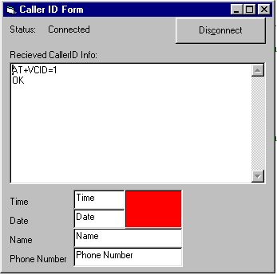



## VB Caller ID Prog

### Description

This program is meant to be a reference to creating your own caller ID program, not an off the shelf application that works for everyone. There are several aspects of this program that will have to be taken into account before running it successfully.
 
### More Info
 

             |
---                |---
**Submitted On**   |2002-08-03 19:17:44
**By**             |[Paul Bergman](https://github.com/Planet-Source-Code/PSCIndex/blob/master/ByAuthor/paul-bergman.md)
**Level**          |Beginner
**User Rating**    |4.8 (24 globes from 5 users)
**Compatibility**  |VB 6\.0
**Category**       |[Files/ File Controls/ Input/ Output](https://github.com/Planet-Source-Code/PSCIndex/blob/master/ByCategory/files-file-controls-input-output__1-3.md)
**World**          |[Visual Basic](https://github.com/Planet-Source-Code/PSCIndex/blob/master/ByWorld/visual-basic.md)
**Archive File**   |[VB\_Caller\_114040832002\.zip](https://github.com/Planet-Source-Code/paul-bergman-vb-caller-id-prog__1-37602/archive/master.zip)

